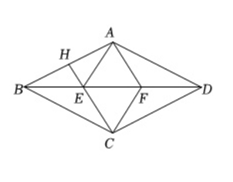

<h3><a href="">Slow Perception:Let's Perceive Geometric Figures Step-by-step</a></h3>

 

[Haoran Wei*](https://scholar.google.com/citations?user=J4naK0MAAAAJ&hl=en), Yinyang You*, Yumeng Li, Jia Wang, [Liang Zhao](https://scholar.google.com.hk/citations?user=uJJ5zskAAAAJ&hl=zh-CN&oi=sra),  [Jianjian Sun](https://scholar.google.com/citations?user=MVZrGkYAAAAJ&hl=en), [Zheng Ge](https://joker316701882.github.io/), [Xiangyu Zhang](https://scholar.google.com/citations?user=yuB-cfoAAAAJ&hl=en)

&emsp;&emsp;&emsp;&emsp; ***Accurate copying is the first step to visual o1!***

## Release
- [2024/12/24]🔥🔥🔥 We release the slow perception! The paper can be found [here](https://github.com/Ucas-HaoranWei/Slow-Perception/blob/main/Slow_perception.pdf) temporarily and we will submit it to arxiv soon.

## Contents
- [Install](#install)
- [Weights](#weights)
- [Eval](#eval)
- [Data&Benchmark](#data&benchmark)
- [Train](#train)

